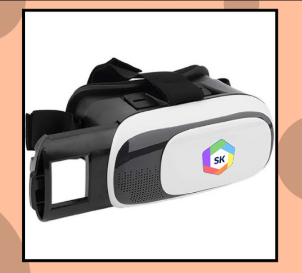
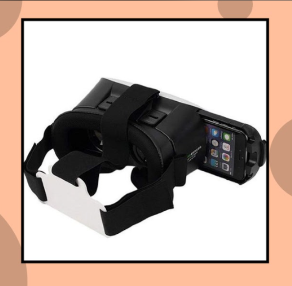

### Using the VR Headset

1. Go to app or scan QR code

2. Take out your phone holder.

3. Play VR resources (SK App)

4. Put the phone in the middle of the holder.

5. Put in the phone holder into the VRBox.

6. Adjust focal length and IPD.

7. Explore the SK app and enjoy.
