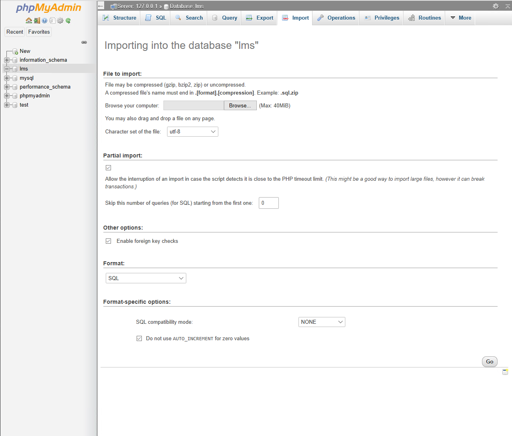

1. Open your browser and visit localhost/phpmyadmin
2. Click Databases
   
3. Create new database
   
4. Click Import
   
5. Click click browse and navigate to htdocs/aws/admin folder
   
6. Select stockknowledge.sql and click open.
   
7. Click Go
   
8. Done
   
