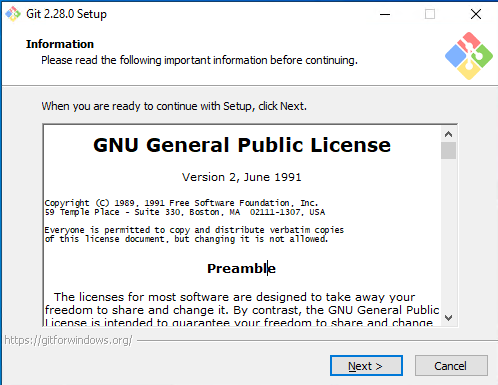
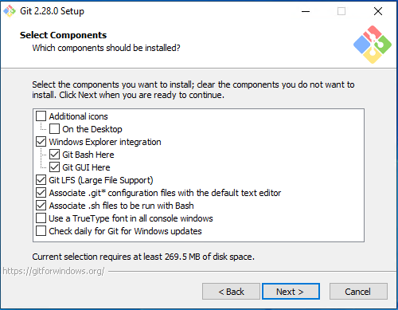
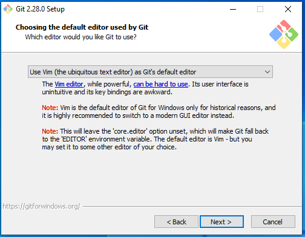
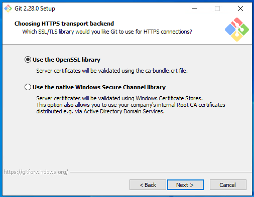
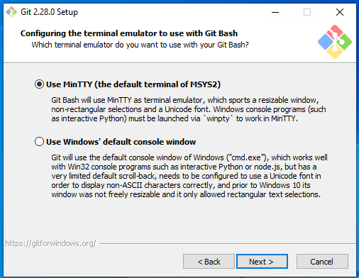
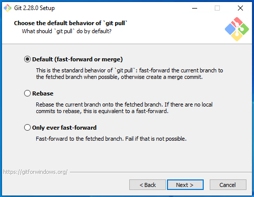
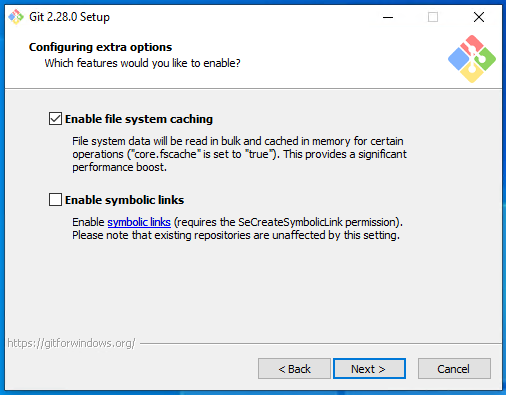
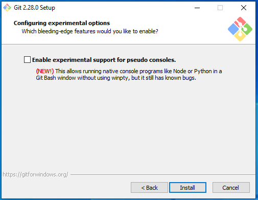
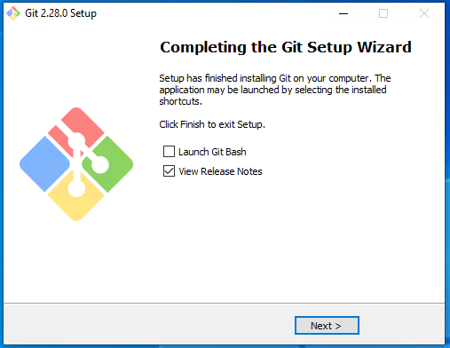

1. Download [Git](https://www.apachefriends.org/download.html)
2. Open the download binary file
3. Click next
   
4. Click next
   
5. Click next
   
6. Click next
   
7. Click next
   
8. Click next
   
9. Click next
   
10. Click next
    
11. Click next
    
12. Click next
    
13. Click next
    
14. Click next
    
15. Click Install
    
16. Wait Until installation is finish
    
17. Click next. Done.
    
