1. Download [XAMPP](https://www.apachefriends.org/download.html)
2. Open the download binary file
3. Click Next
   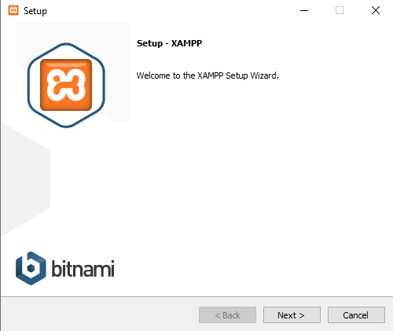
4. Click Next
   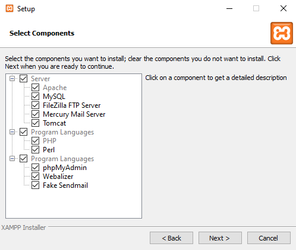
5. Change the path if you want to change the installation folder then click next
   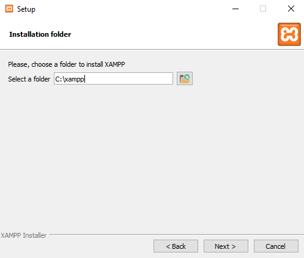
6. Select your language then click next
   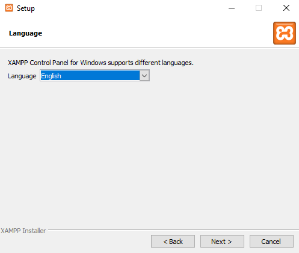
7. Uncheck checkbox and click next
   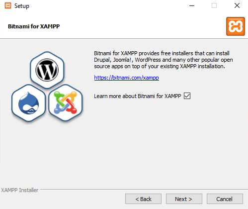
8. Click next
   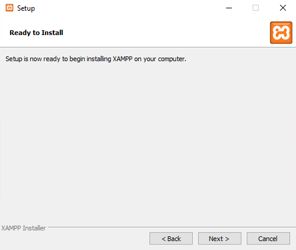
9. Wait until installation is finish
   
10. Uncheck checkbox and click Finish
    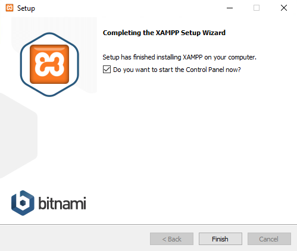
11. Run XAMPP as adminstrator
    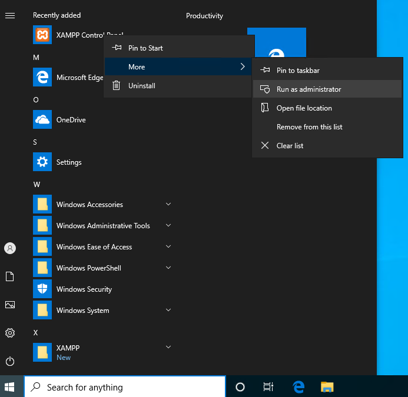
12. (Optional) Install Apache server to automatically start apache on windows startup. Click the red "X" mark beside Apache and click Yes.
    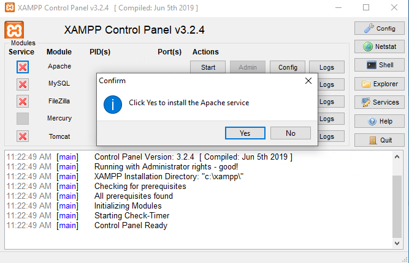
13. Click Allow access
    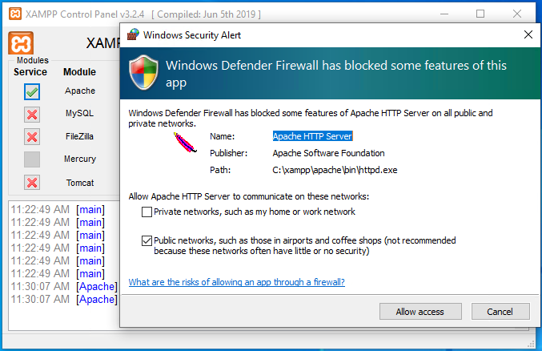
14. (Optional) Install MySQL server to automatically start MySQL server on windows startup. Click the red "X" mark beside MySQL and click Yes.
    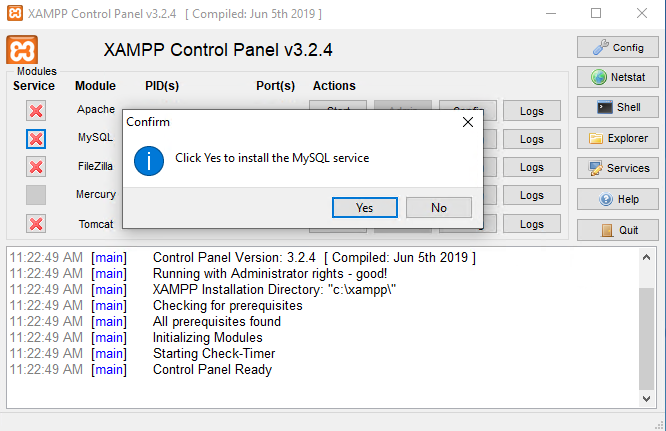
15. Press Start button of Apace and MySQL then visit http://localhost
    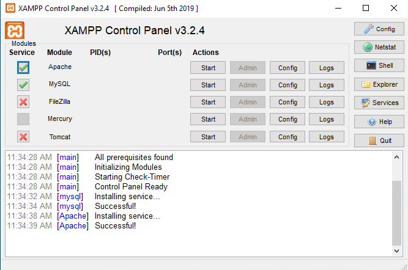
16. Done!
    
